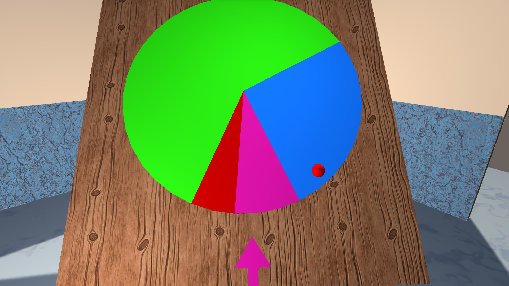

# Roller
A simple runner made with Unity
## What does it look like?

The red ball at the right bottom is your cursor, which can roll the runner
with a intuitive gesture.

The arrow at the bottom of the board indicates the result of the runner.

## How can I change the possibility of each item?
Simple. Just clone the project and compile yours.
